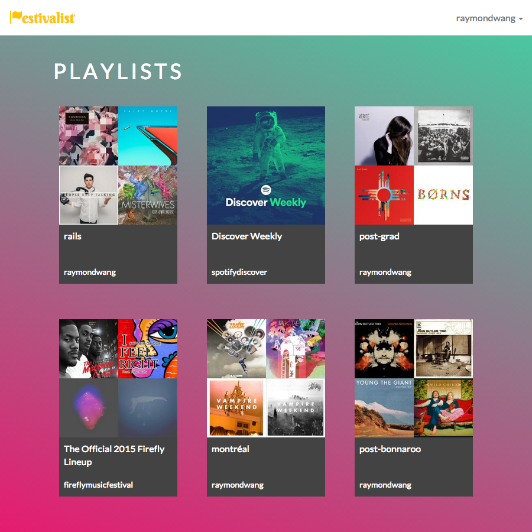

# Festivalist

An app that checks for upcoming shows by artists featured in your Spotify playlists.

---

## Screenshots

---

## Technologies Used

* Ruby on Rails
* JavaScript (ES6)
* React
* Spotify API
* Bandsintown API
* Google Places API
* PostgreSQL
* Sass
* Bootstrap

---

## User Stories

* As a user, I would like to be able to sign in via Spotify.
* As a user, I would like to be able to see the playlists that I own and the playlists that I follow on a single page.
* As a user, I would like to be able to see all of the upcoming shows by artists in a playlist.
* As a user, I would like to be able to change and save my location settings in order to search for shows in different areas.
* As a user, I would like to be able to see if a show is sold out or if tickets are available.
* As a user, I would like to be able to navigate directly to a show's page in order to bookmark the show or buy tickets.
